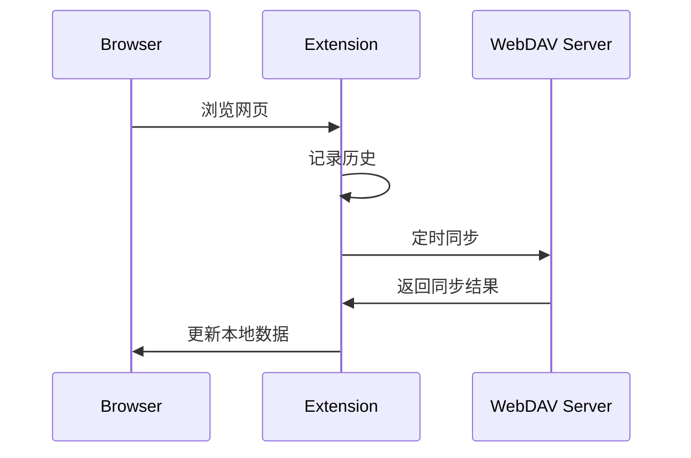

# WebDAV 浏览器历史同步扩展

> 通过 WebDAV 同步 Chrome 内核浏览器历史记录，并生成可视化报告

## 功能特性

### 🎯 核心功能
- **跨设备同步**: 通过 WebDAV 协议在多个设备间同步浏览器历史记录
- **历史记录可视化**: 生成美观的浏览历史统计报告
- **多格式导出**: 支持将历史记录导出为 JSON、CSV、HTML 格式
- **智能冲突解决**: 自动处理同步过程中的冲突
- **数据去重**: 自动清理重复的浏览记录
- **自动清理**: 可配置的旧数据自动清理功能

### 🛡️ 安全特性
- **端到端加密**: 敏感数据加密存储
- **隐私保护**: 本地处理，数据不经过第三方服务器
- **权限控制**: 细粒度的权限管理

### 📊 可视化功能
- **访问趋势图**: 按时间维度展示浏览习惯
- **热门网站统计**: 显示访问频率最高的网站
- **时段分析**: 分析一天中不同时段的浏览习惯
- **设备分布**: 查看不同设备的使用情况

## 快速开始

### 安装要求
- Chrome/Edge 浏览器 (版本 100+)
- WebDAV 服务器 (如 Nextcloud、ownCloud、群晖 NAS 等)

### 安装步骤

1. **下载扩展**
   ```bash
   git clone https://github.com/idleeyan/Browser-history-sync.git
   ```

2. **构建扩展**
   ```bash
   npm install
   npm run build
   ```

3. **加载扩展**
   - 打开 Chrome/Edge 浏览器
   - 进入 `chrome://extensions/` 或 `edge://extensions/`
   - 开启「开发者模式」
   - 点击「加载已解压的扩展程序」
   - 选择项目根目录

4. **配置 WebDAV**
   - 点击扩展图标
   - 进入设置页面
   - 输入 WebDAV 服务器地址、用户名和密码
   - 测试连接并保存配置

## 配置说明

### WebDAV 配置
| 参数 | 说明 | 示例 |
|------|------|------|
| 服务器地址 | WebDAV 服务器 URL | `https://example.com/remote.php/dav/files/username/` |
| 用户名 | WebDAV 用户名 | `username` |
| 密码 | WebDAV 密码 | `password` |
| 同步间隔 | 自动同步间隔（分钟） | `60` |
| 保留天数 | 历史记录保留天数 | `365` |

### 高级配置
```json
{
  "syncInterval": 60,
  "retentionDays": 365,
  "enableEncryption": true,
  "autoCleanup": true,
  "conflictResolution": "latest"
}
```

## 使用指南

### 手动同步
1. 点击扩展图标
2. 点击「立即同步」按钮
3. 等待同步完成

### 生成报告
1. 点击扩展图标
2. 点击「查看报告」
3. 在报告页面查看详细统计信息

### 导出数据
1. 进入设置页面
2. 选择导出格式
3. 点击「导出数据」按钮

## 技术架构

### 前端技术栈
- **Manifest V3**: 浏览器扩展最新标准
- **React**: UI 组件库
- **Tailwind CSS**: 样式框架
- **Chart.js**: 图表库

### 核心模块
```
├── background/          # 后台服务
│   ├── history-api.js   # 历史记录 API
│   └── service_worker.js # 服务工作线程
├── ui/                  # 用户界面
│   ├── popup.html       # 弹出窗口
│   ├── options.html     # 设置页面
│   └── report.html      # 报告页面
├── utils/               # 工具函数
│   ├── sync-utils.js    # 同步工具
│   ├── encrypt-utils.js # 加密工具
│   └── data-process.js  # 数据处理
└── icons/               # 图标资源
```

### 同步流程


## 开发指南

### 环境要求
- Node.js 16+
- npm 8+

### 开发命令
```bash
# 安装依赖
npm install

# 开发模式（自动重新构建）
npm run dev

# 生产构建
npm run build

# 代码检查
npm run lint
```

### 调试技巧
1. 打开开发者工具
2. 进入「Service Worker」面板
3. 查看后台日志
4. 使用 `chrome.storage.local.get()` 查看存储数据

## 常见问题

### Q: 同步失败怎么办？
A: 请检查：
1. WebDAV 服务器地址是否正确
2. 用户名和密码是否正确
3. 网络连接是否正常
4. 服务器是否支持 WebDAV 协议

### Q: 扩展占用资源过高？
A: 可以尝试：
1. 增加同步间隔
2. 减少保留天数
3. 关闭不必要的可视化功能

### Q: 如何迁移到新设备？
A: 导出数据后在新设备上导入即可。

## 贡献指南

欢迎提交 Issue 和 Pull Request！

### 提交规范
- feat: 新功能
- fix: 修复 bug
- docs: 文档更新
- style: 代码格式调整
- refactor: 代码重构
- perf: 性能优化
- test: 测试相关

## 许可证

MIT License - 详见 [LICENSE](LICENSE) 文件

## 更新日志

详见 [CHANGELOG.md](CHANGELOG.md)

## 联系方式

- 项目地址: https://github.com/idleeyan/Browser-history-sync
- 提交 Issue: https://github.com/idleeyan/Browser-history-sync/issues

---

**注意**: 本扩展仅供学习和个人使用，请遵守相关法律法规。